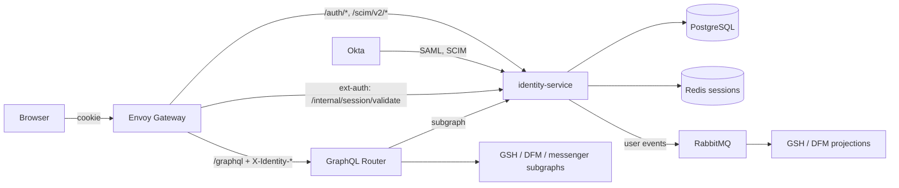

# Architecture

Architecture decision record: `dev/notes/architecture/gsh-dfm-shared-ui-identity.md` (Obsidian vault, 2026-09-09). Requirements live in [`openspec/specs`](../openspec/specs), planned work in [`openspec/changes`](../openspec/changes).

## Scope

Implemented: SAML SSO against Okta, server-side sessions in Redis, unified user storage in PostgreSQL, access control (applications, roles, permissions, assignments, append-only audit journal), a GraphQL federation subgraph for profiles and access management, health/readiness endpoints and the internal session-validation endpoint for the entry-point proxy.

Also implemented: SCIM 2.0 provisioning from Okta (create/update/deactivate with immediate session revocation), user-change events delivered to RabbitMQ through a transactional outbox, and observability (Sentry error reporting, Prometheus metrics, panic recovery).

Planned as a separate OpenSpec change: Single Logout. The GraphQL Router spike is done on the local stand ([playbook](playbooks/LOCAL_STAND.md)); a production router and a schema registry are not deployed yet.

## Context

Integration contracts: [INTEGRATIONS.md](INTEGRATIONS.md).

## Components

| Package | Responsibility |
| --- | --- |
| `cmd/identity-service` | entrypoint and CLI subcommands; explicit wiring |
| `internal/config` | environment variables as cleanenv tags; source of [CONFIGURATION.md](CONFIGURATION.md) |
| `internal/httpserver` | public and internal listeners, probes, graceful shutdown |
| `internal/identity` | the user domain: unified users and their external identities |
| `internal/access` | applications, roles, permissions, assignments, permission evaluation |
| `internal/session` | server-side browser sessions in Redis, including the revocation fences |
| `internal/samlsso` | the SAML 2.0 service-provider flow |
| `internal/scim` | the SCIM 2.0 subset used by the Okta provisioning client |
| `internal/graphql` | the Users & Access GraphQL subgraph |
| `internal/events` | the user-change event contract and the outbox relay |
| `internal/postgres` | persistence adapters on pgx |
| `internal/redisstore` | Redis-backed state every replica must see: the one-shot identifiers of the SAML sign-in flow |
| `internal/cache` | bounded, TTL-expiring, single-flight lookup cache |
| `internal/observability`, `internal/logging` | metrics, Sentry, panic recovery, JSON logs |

## Data

- **PostgreSQL** stores users, external identity mappings, roles, permissions, assignments, access audit records and the event outbox. Per-table reference: [`docs/schema`](schema/README.md).
- **Redis** stores server-side sessions, one-shot SAML request and assertion ids, and session revocation fences.

## Access control

Roles and permissions belong to applications; assignments are the only source of truth for user access and change only in this service. Every change is journaled in `access_audit_log` within the same transaction. Bootstrap and bulk imports: [the access setup playbook](playbooks/ACCESS_SETUP.md).

## Sessions and revocation

The browser holds an opaque session id in an HttpOnly cookie; the session lives in Redis.

Revocation is a *generation*, not a deletion: every user carries a session epoch, a session records it at sign-in, and deactivation bumps it in the same transaction that clears the flag. The epoch is mirrored into Redis as a fence checked on every session load **and save**, so a request that was holding the session when it was revoked cannot write it back, and a Redis failure during deactivation cannot undo a revocation that is already in the database (the SCIM call still succeeds; the failure is logged and counted in `session_revocation_errors_total`, and the stale sessions are refused within the revocation delay).

## Outbox relay

User events are written to `user_events_outbox` in the transaction of the change and published by a relay inside `serve` ([contract](events/user-events.md)).

- **Leases, not locks.** A short transaction claims a batch under a 5-minute lease; publishing with confirms happens outside any transaction; a second short transaction records the outcome. A replica that dies mid-batch releases its rows when the lease expires (possibly producing a duplicate — hence the `message_id` dedup consumers do).
- **Per-user order on every replica.** A row is claimed only when it is the earliest pending event of its user, so two relays never hold events of the same user at once and versions arrive in order.
- **Backoff and quarantine.** Only a failure *of the message* (a broker nack) spends its retry budget — exponential backoff (1 s → 5 min), quarantine after 10 attempts. A broker outage is a transport failure: the row is released untouched and the relay as a whole backs off, so an outage never quarantines valid events. A quarantined event stops blocking the user's later events (the version gap is visible to consumers; `replay-users` repairs a projection). `outbox_quarantined` counts them, `last_error` says why, `requeue-events` returns them to the queue once the cause is fixed.
- **Retention.** Published rows are deleted after `OUTBOX_RETENTION` (default 30 days) in small batches; pending and quarantined rows are never trimmed.

Rolling out the lease-based relay onto an environment that already runs the pre-lease relay needs a one-time `strategy: Recreate` (or scaling the old release to zero first): an old replica ignores leases and publishes inside its own transaction in `created_at` order, so overlapping old and new relays could invert a user's versions during that single rollout.

## Observability

- Logs are JSONL on stdout (`log/slog`). With `SENTRY_DSN` set, error-level records and handler panics are additionally reported to Sentry as issues (environment = `APP_ENV`); panics always return 500 and never kill the process.
- `GET /internal/metrics` serves Prometheus metrics on the internal listener (`INTERNAL_LISTEN_ADDR`, same zone as validate; the ServiceMonitor scrapes the `internal` Service port): standard Go/process collectors, `http_request_duration_seconds` / `http_requests_total` by route pattern, `outbox_pending` / `outbox_quarantined` / `outbox_oldest_pending_age_seconds` (refreshed every relay loop, broker or no broker) / `events_published_total` / `event_publish_errors_total` / `outbox_unroutable_total`, `sign_ins_total{result}`, `scim_operations_total{op}`, `session_revocation_errors_total` (deactivations whose sessions could not be destroyed after the revocation was recorded) and `cache_requests_total{cache,result}`, `cache_entries{cache}` and `cache_evictions_total{cache}` for the user/permissions caches.
