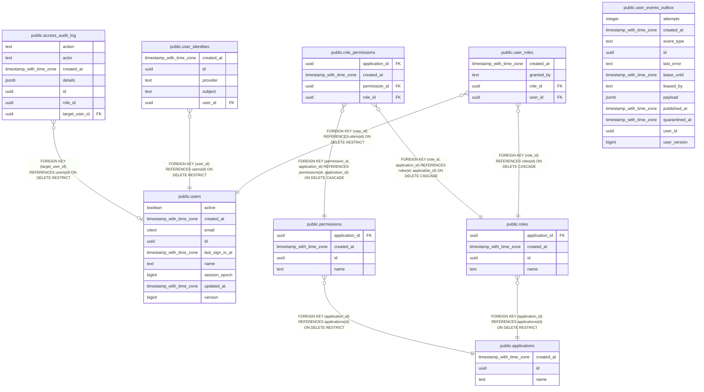

# identity_development

## Tables

| Name                                                      | Columns | Comment                                                                              | Type       |
| --------------------------------------------------------- | ------- | ------------------------------------------------------------------------------------ | ---------- |
| [public.access_audit_log](public.access_audit_log.md)     | 7       | Append-only journal of access changes, written in the same transaction as the change | BASE TABLE |
| [public.applications](public.applications.md)             | 3       | Business applications owning roles and permissions (e.g. gsh, dfm)                   | BASE TABLE |
| [public.permissions](public.permissions.md)               | 4       | Permissions owned by applications; granted to users through roles                    | BASE TABLE |
| [public.role_permissions](public.role_permissions.md)     | 4       | Role composition; same-application invariant enforced by composite FKs               | BASE TABLE |
| [public.roles](public.roles.md)                           | 4       | Roles owned by applications; assigned to users via user_roles                        | BASE TABLE |
| [public.user_events_outbox](public.user_events_outbox.md) | 12      | Transactional outbox: user-change events awaiting publication to RabbitMQ            | BASE TABLE |
| [public.user_identities](public.user_identities.md)       | 5       | External identity mappings (SSO providers) to unified users                          | BASE TABLE |
| [public.user_roles](public.user_roles.md)                 | 4       | Role assignments; the only source of truth for user access                           | BASE TABLE |
| [public.users](public.users.md)                           | 9       | Unified application users shared across GSH/DFM ecosystem                            | BASE TABLE |

## Stored procedures and functions

| Name                         | ReturnType | Arguments                                                   | Type     |
| ---------------------------- | ---------- | ----------------------------------------------------------- | -------- |
| public.citext                | citext     | boolean                                                     | FUNCTION |
| public.citext                | citext     | character                                                   | FUNCTION |
| public.citext                | citext     | inet                                                        | FUNCTION |
| public.citext_cmp            | int4       | citext, citext                                              | FUNCTION |
| public.citext_eq             | bool       | citext, citext                                              | FUNCTION |
| public.citext_ge             | bool       | citext, citext                                              | FUNCTION |
| public.citext_gt             | bool       | citext, citext                                              | FUNCTION |
| public.citext_hash           | int4       | citext                                                      | FUNCTION |
| public.citext_hash_extended  | int8       | citext, bigint                                              | FUNCTION |
| public.citext_larger         | citext     | citext, citext                                              | FUNCTION |
| public.citext_le             | bool       | citext, citext                                              | FUNCTION |
| public.citext_lt             | bool       | citext, citext                                              | FUNCTION |
| public.citext_ne             | bool       | citext, citext                                              | FUNCTION |
| public.citext_pattern_cmp    | int4       | citext, citext                                              | FUNCTION |
| public.citext_pattern_ge     | bool       | citext, citext                                              | FUNCTION |
| public.citext_pattern_gt     | bool       | citext, citext                                              | FUNCTION |
| public.citext_pattern_le     | bool       | citext, citext                                              | FUNCTION |
| public.citext_pattern_lt     | bool       | citext, citext                                              | FUNCTION |
| public.citext_smaller        | citext     | citext, citext                                              | FUNCTION |
| public.citextin              | citext     | cstring                                                     | FUNCTION |
| public.citextout             | cstring    | citext                                                      | FUNCTION |
| public.citextrecv            | citext     | internal                                                    | FUNCTION |
| public.citextsend            | bytea      | citext                                                      | FUNCTION |
| public.max                   | citext     | citext                                                      | a        |
| public.min                   | citext     | citext                                                      | a        |
| public.regexp_match          | _text      | string citext, pattern citext                               | FUNCTION |
| public.regexp_match          | _text      | string citext, pattern citext, flags text                   | FUNCTION |
| public.regexp_matches        | _text      | string citext, pattern citext                               | FUNCTION |
| public.regexp_matches        | _text      | string citext, pattern citext, flags text                   | FUNCTION |
| public.regexp_replace        | text       | string citext, pattern citext, replacement text             | FUNCTION |
| public.regexp_replace        | text       | string citext, pattern citext, replacement text, flags text | FUNCTION |
| public.regexp_split_to_array | _text      | string citext, pattern citext                               | FUNCTION |
| public.regexp_split_to_array | _text      | string citext, pattern citext, flags text                   | FUNCTION |
| public.regexp_split_to_table | text       | string citext, pattern citext                               | FUNCTION |
| public.regexp_split_to_table | text       | string citext, pattern citext, flags text                   | FUNCTION |
| public.replace               | text       | citext, citext, citext                                      | FUNCTION |
| public.split_part            | text       | citext, citext, integer                                     | FUNCTION |
| public.strpos                | int4       | citext, citext                                              | FUNCTION |
| public.texticlike            | bool       | citext, citext                                              | FUNCTION |
| public.texticlike            | bool       | citext, text                                                | FUNCTION |
| public.texticnlike           | bool       | citext, citext                                              | FUNCTION |
| public.texticnlike           | bool       | citext, text                                                | FUNCTION |
| public.texticregexeq         | bool       | citext, citext                                              | FUNCTION |
| public.texticregexeq         | bool       | citext, text                                                | FUNCTION |
| public.texticregexne         | bool       | citext, citext                                              | FUNCTION |
| public.texticregexne         | bool       | citext, text                                                | FUNCTION |
| public.translate             | text       | citext, citext, text                                        | FUNCTION |

## Relations

---

> Generated by [tbls](https://github.com/k1LoW/tbls)
