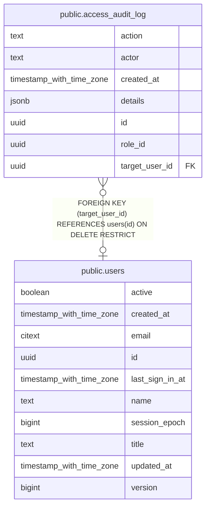

# public.access_audit_log

## Description

Append-only journal of access changes, written in the same transaction as the change

## Columns

| Name           | Type                     | Default           | Nullable | Children | Parents                         | Comment                                                          |
| -------------- | ------------------------ | ----------------- | -------- | -------- | ------------------------------- | ---------------------------------------------------------------- |
| action         | text                     |                   | false    |          |                                 | Action name, e.g. role.grant, role.revoke, role.composition      |
| actor          | text                     |                   | false    |          |                                 | Who performed the change (cli or a user reference)               |
| created_at     | timestamp with time zone | now()             | false    |          |                                 | When the change happened                                         |
| details        | jsonb                    | '{}'::jsonb       | false    |          |                                 | Action details (application/role/permission names)               |
| id             | uuid                     | gen_random_uuid() | false    |          |                                 | Journal entry UUID                                               |
| role_id        | uuid                     |                   | true     |          |                                 | Affected role; kept without FK so history survives role deletion |
| target_user_id | uuid                     |                   | true     |          | [public.users](public.users.md) | Affected user, when the action targets a user                    |

## Constraints

| Name                                 | Type        | Definition                                                           |
| ------------------------------------ | ----------- | -------------------------------------------------------------------- |
| access_audit_log_action_not_null     | n           | NOT NULL action                                                      |
| access_audit_log_actor_not_null      | n           | NOT NULL actor                                                       |
| access_audit_log_created_at_not_null | n           | NOT NULL created_at                                                  |
| access_audit_log_details_not_null    | n           | NOT NULL details                                                     |
| access_audit_log_id_not_null         | n           | NOT NULL id                                                          |
| access_audit_log_pkey                | PRIMARY KEY | PRIMARY KEY (id)                                                     |
| access_audit_log_target_user_id_fkey | FOREIGN KEY | FOREIGN KEY (target_user_id) REFERENCES users(id) ON DELETE RESTRICT |

## Indexes

| Name                             | Definition                                                                                            |
| -------------------------------- | ----------------------------------------------------------------------------------------------------- |
| access_audit_log_created_at_idx  | CREATE INDEX access_audit_log_created_at_idx ON public.access_audit_log USING btree (created_at)      |
| access_audit_log_pkey            | CREATE UNIQUE INDEX access_audit_log_pkey ON public.access_audit_log USING btree (id)                 |
| access_audit_log_target_user_idx | CREATE INDEX access_audit_log_target_user_idx ON public.access_audit_log USING btree (target_user_id) |

## Relations

---

> Generated by [tbls](https://github.com/k1LoW/tbls)
