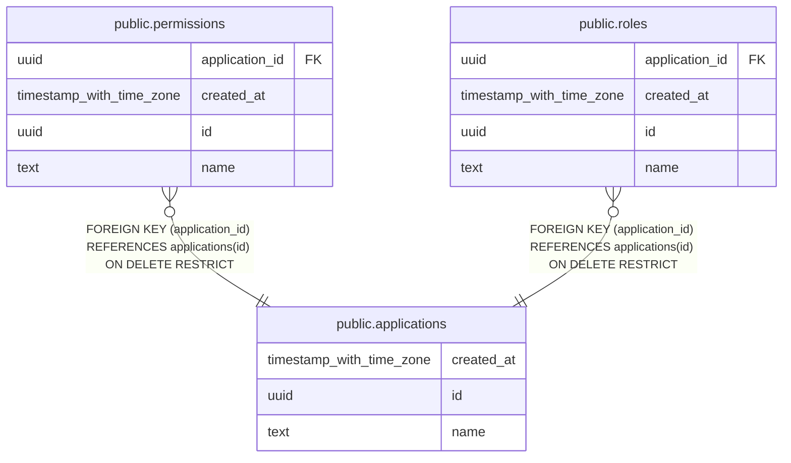

# public.applications

## Description

Business applications owning roles and permissions (e.g. gsh, dfm)

## Columns

| Name       | Type                     | Default           | Nullable | Children                                                                    | Parents | Comment                 |
| ---------- | ------------------------ | ----------------- | -------- | --------------------------------------------------------------------------- | ------- | ----------------------- |
| created_at | timestamp with time zone | now()             | false    |                                                                             |         | Row creation timestamp  |
| id         | uuid                     | gen_random_uuid() | false    | [public.permissions](public.permissions.md) [public.roles](public.roles.md) |         | Application UUID        |
| name       | text                     |                   | false    |                                                                             |         | Unique application name |

## Constraints

| Name                             | Type        | Definition          |
| -------------------------------- | ----------- | ------------------- |
| applications_created_at_not_null | n           | NOT NULL created_at |
| applications_id_not_null         | n           | NOT NULL id         |
| applications_name_not_null       | n           | NOT NULL name       |
| applications_name_unique         | UNIQUE      | UNIQUE (name)       |
| applications_pkey                | PRIMARY KEY | PRIMARY KEY (id)    |

## Indexes

| Name                     | Definition                                                                             |
| ------------------------ | -------------------------------------------------------------------------------------- |
| applications_name_unique | CREATE UNIQUE INDEX applications_name_unique ON public.applications USING btree (name) |
| applications_pkey        | CREATE UNIQUE INDEX applications_pkey ON public.applications USING btree (id)          |

## Relations

---

> Generated by [tbls](https://github.com/k1LoW/tbls)
