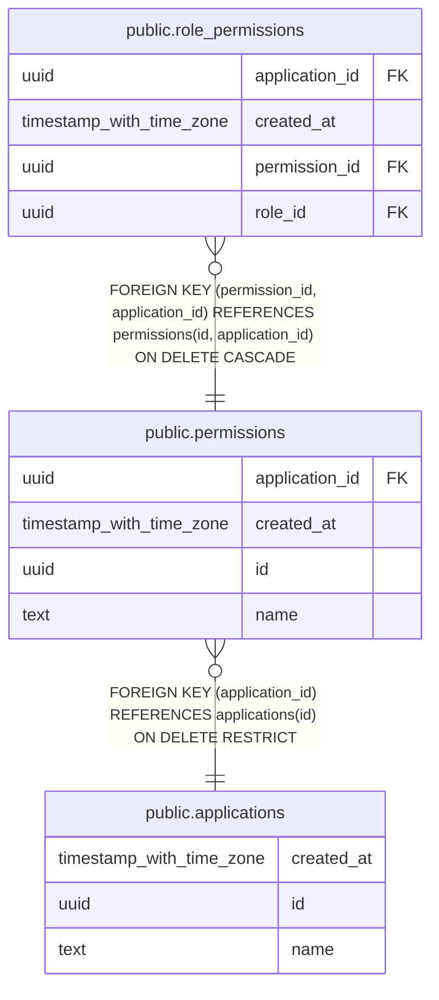

# public.permissions

## Description

Permissions owned by applications; granted to users through roles

## Columns

| Name           | Type                     | Default           | Nullable | Children                                              | Parents                                       | Comment                                        |
| -------------- | ------------------------ | ----------------- | -------- | ----------------------------------------------------- | --------------------------------------------- | ---------------------------------------------- |
| application_id | uuid                     |                   | false    | [public.role_permissions](public.role_permissions.md) | [public.applications](public.applications.md) | Owning application                             |
| created_at     | timestamp with time zone | now()             | false    |                                                       |                                               | Row creation timestamp                         |
| id             | uuid                     | gen_random_uuid() | false    | [public.role_permissions](public.role_permissions.md) |                                               | Permission UUID                                |
| name           | text                     |                   | false    |                                                       |                                               | Permission name, unique within the application |

## Constraints

| Name                                | Type        | Definition                                                                  |
| ----------------------------------- | ----------- | --------------------------------------------------------------------------- |
| permissions_application_id_fkey     | FOREIGN KEY | FOREIGN KEY (application_id) REFERENCES applications(id) ON DELETE RESTRICT |
| permissions_application_id_not_null | n           | NOT NULL application_id                                                     |
| permissions_application_name_unique | UNIQUE      | UNIQUE (application_id, name)                                               |
| permissions_created_at_not_null     | n           | NOT NULL created_at                                                         |
| permissions_id_application_unique   | UNIQUE      | UNIQUE (id, application_id)                                                 |
| permissions_id_not_null             | n           | NOT NULL id                                                                 |
| permissions_name_not_null           | n           | NOT NULL name                                                               |
| permissions_pkey                    | PRIMARY KEY | PRIMARY KEY (id)                                                            |

## Indexes

| Name                                | Definition                                                                                                       |
| ----------------------------------- | ---------------------------------------------------------------------------------------------------------------- |
| permissions_application_name_unique | CREATE UNIQUE INDEX permissions_application_name_unique ON public.permissions USING btree (application_id, name) |
| permissions_id_application_unique   | CREATE UNIQUE INDEX permissions_id_application_unique ON public.permissions USING btree (id, application_id)     |
| permissions_pkey                    | CREATE UNIQUE INDEX permissions_pkey ON public.permissions USING btree (id)                                      |

## Relations

---

> Generated by [tbls](https://github.com/k1LoW/tbls)
