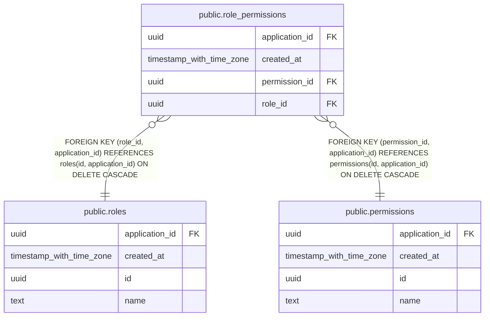

# public.role_permissions

## Description

Role composition; same-application invariant enforced by composite FKs

## Columns

| Name           | Type                     | Default | Nullable | Children | Parents                                                                     | Comment                                             |
| -------------- | ------------------------ | ------- | -------- | -------- | --------------------------------------------------------------------------- | --------------------------------------------------- |
| application_id | uuid                     |         | false    |          | [public.roles](public.roles.md) [public.permissions](public.permissions.md) | Application owning both the role and the permission |
| created_at     | timestamp with time zone | now()   | false    |          |                                                                             | When the permission was added to the role           |
| permission_id  | uuid                     |         | false    |          | [public.permissions](public.permissions.md)                                 | Permission included in the role                     |
| role_id        | uuid                     |         | false    |          | [public.roles](public.roles.md)                                             | Role                                                |

## Constraints

| Name                                               | Type        | Definition                                                                                               |
| -------------------------------------------------- | ----------- | -------------------------------------------------------------------------------------------------------- |
| role_permissions_application_id_not_null           | n           | NOT NULL application_id                                                                                  |
| role_permissions_created_at_not_null               | n           | NOT NULL created_at                                                                                      |
| role_permissions_permission_id_application_id_fkey | FOREIGN KEY | FOREIGN KEY (permission_id, application_id) REFERENCES permissions(id, application_id) ON DELETE CASCADE |
| role_permissions_permission_id_not_null            | n           | NOT NULL permission_id                                                                                   |
| role_permissions_pkey                              | PRIMARY KEY | PRIMARY KEY (role_id, permission_id)                                                                     |
| role_permissions_role_id_application_id_fkey       | FOREIGN KEY | FOREIGN KEY (role_id, application_id) REFERENCES roles(id, application_id) ON DELETE CASCADE             |
| role_permissions_role_id_not_null                  | n           | NOT NULL role_id                                                                                         |

## Indexes

| Name                  | Definition                                                                                                |
| --------------------- | --------------------------------------------------------------------------------------------------------- |
| role_permissions_pkey | CREATE UNIQUE INDEX role_permissions_pkey ON public.role_permissions USING btree (role_id, permission_id) |

## Relations

---

> Generated by [tbls](https://github.com/k1LoW/tbls)
