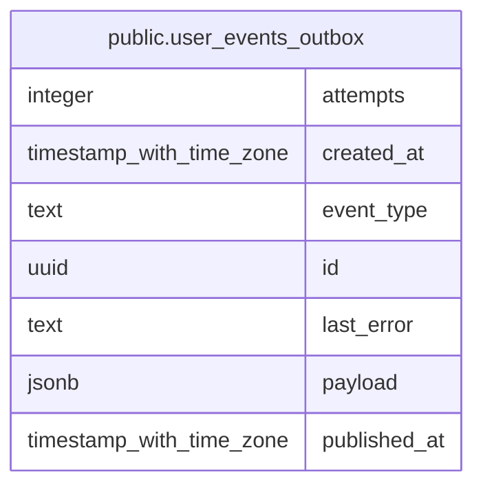

# public.user_events_outbox

## Description

Transactional outbox: user-change events awaiting publication to RabbitMQ

## Columns

| Name         | Type                     | Default           | Nullable | Children | Parents | Comment                                                        |
| ------------ | ------------------------ | ----------------- | -------- | -------- | ------- | -------------------------------------------------------------- |
| attempts     | integer                  | 0                 | false    |          |         | Publish attempts counter                                       |
| created_at   | timestamp with time zone | now()             | false    |          |         | When the event was recorded (with the user change transaction) |
| event_type   | text                     |                   | false    |          |         | Event type, e.g. identity.user.updated                         |
| id           | uuid                     | gen_random_uuid() | false    |          |         | Event UUID; published as the AMQP message id                   |
| last_error   | text                     |                   | true     |          |         | Last publish error, if any                                     |
| payload      | jsonb                    |                   | false    |          |         | Event body as delivered to consumers                           |
| published_at | timestamp with time zone |                   | true     |          |         | Broker publish timestamp; NULL while pending                   |

## Constraints

| Name                                   | Type        | Definition          |
| -------------------------------------- | ----------- | ------------------- |
| user_events_outbox_attempts_not_null   | n           | NOT NULL attempts   |
| user_events_outbox_created_at_not_null | n           | NOT NULL created_at |
| user_events_outbox_event_type_not_null | n           | NOT NULL event_type |
| user_events_outbox_id_not_null         | n           | NOT NULL id         |
| user_events_outbox_payload_not_null    | n           | NOT NULL payload    |
| user_events_outbox_pkey                | PRIMARY KEY | PRIMARY KEY (id)    |

## Indexes

| Name                               | Definition                                                                                                                         |
| ---------------------------------- | ---------------------------------------------------------------------------------------------------------------------------------- |
| user_events_outbox_pkey            | CREATE UNIQUE INDEX user_events_outbox_pkey ON public.user_events_outbox USING btree (id)                                          |
| user_events_outbox_unpublished_idx | CREATE INDEX user_events_outbox_unpublished_idx ON public.user_events_outbox USING btree (created_at) WHERE (published_at IS NULL) |

## Relations

---

> Generated by [tbls](https://github.com/k1LoW/tbls)
