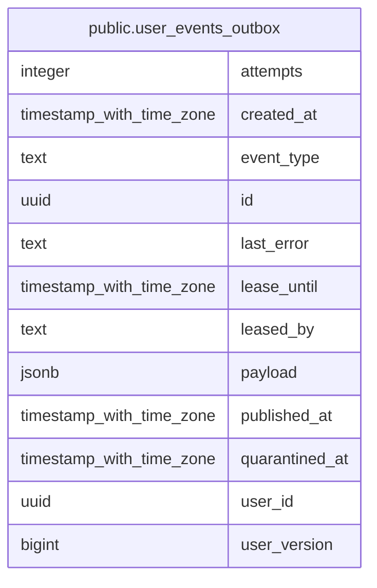

# public.user_events_outbox

## Description

Transactional outbox: user-change events awaiting publication to RabbitMQ

## Columns

| Name           | Type                     | Default           | Nullable | Children | Parents | Comment                                                                                                                         |
| -------------- | ------------------------ | ----------------- | -------- | -------- | ------- | ------------------------------------------------------------------------------------------------------------------------------- |
| attempts       | integer                  | 0                 | false    |          |         | Publish attempts counter                                                                                                        |
| created_at     | timestamp with time zone | now()             | false    |          |         | When the event was recorded (with the user change transaction)                                                                  |
| event_type     | text                     |                   | false    |          |         | Event type, e.g. identity.user.updated                                                                                          |
| id             | uuid                     | gen_random_uuid() | false    |          |         | Event UUID; published as the AMQP message id                                                                                    |
| last_error     | text                     |                   | true     |          |         | Last publish error, if any                                                                                                      |
| lease_until    | timestamp with time zone |                   | true     |          |         | Row is being published by leased_by until this time; also the not-before time after a failed attempt                            |
| leased_by      | text                     |                   | true     |          |         | Relay replica holding the lease                                                                                                 |
| payload        | jsonb                    |                   | false    |          |         | Event body as delivered to consumers                                                                                            |
| published_at   | timestamp with time zone |                   | true     |          |         | Broker publish timestamp; NULL while pending                                                                                    |
| quarantined_at | timestamp with time zone |                   | true     |          |         | Set after the retry budget is exhausted; excluded from publishing until requeued                                                |
| user_id        | uuid                     |                   | true     |          |         | Subject user; events of one user publish strictly in user_version order across relay replicas                                   |
| user_version   | bigint                   |                   | true     |          |         | Profile version carried by the payload; the per-user publication order (created_at is transaction start time and can invert it) |

## Constraints

| Name                                   | Type        | Definition          |
| -------------------------------------- | ----------- | ------------------- |
| user_events_outbox_attempts_not_null   | n           | NOT NULL attempts   |
| user_events_outbox_created_at_not_null | n           | NOT NULL created_at |
| user_events_outbox_event_type_not_null | n           | NOT NULL event_type |
| user_events_outbox_id_not_null         | n           | NOT NULL id         |
| user_events_outbox_payload_not_null    | n           | NOT NULL payload    |
| user_events_outbox_pkey                | PRIMARY KEY | PRIMARY KEY (id)    |

## Indexes

| Name                                | Definition                                                                                                                                                                                                                                                                                                                       |
| ----------------------------------- | -------------------------------------------------------------------------------------------------------------------------------------------------------------------------------------------------------------------------------------------------------------------------------------------------------------------------------- |
| user_events_outbox_pending_idx      | CREATE INDEX user_events_outbox_pending_idx ON public.user_events_outbox USING btree (created_at, id) WHERE ((published_at IS NULL) AND (quarantined_at IS NULL))                                                                                                                                                                |
| user_events_outbox_pkey             | CREATE UNIQUE INDEX user_events_outbox_pkey ON public.user_events_outbox USING btree (id)                                                                                                                                                                                                                                        |
| user_events_outbox_published_idx    | CREATE INDEX user_events_outbox_published_idx ON public.user_events_outbox USING btree (published_at) WHERE (published_at IS NOT NULL)                                                                                                                                                                                           |
| user_events_outbox_quarantined_idx  | CREATE INDEX user_events_outbox_quarantined_idx ON public.user_events_outbox USING btree (quarantined_at) WHERE (quarantined_at IS NOT NULL)                                                                                                                                                                                     |
| user_events_outbox_user_pending_idx | CREATE INDEX user_events_outbox_user_pending_idx ON public.user_events_outbox USING btree (COALESCE(user_id, (((payload -> 'user'::text) ->> 'id'::text))::uuid), COALESCE(user_version, (((payload -> 'user'::text) ->> 'version'::text))::bigint), created_at, id) WHERE ((published_at IS NULL) AND (quarantined_at IS NULL)) |

## Relations

---

> Generated by [tbls](https://github.com/k1LoW/tbls)
