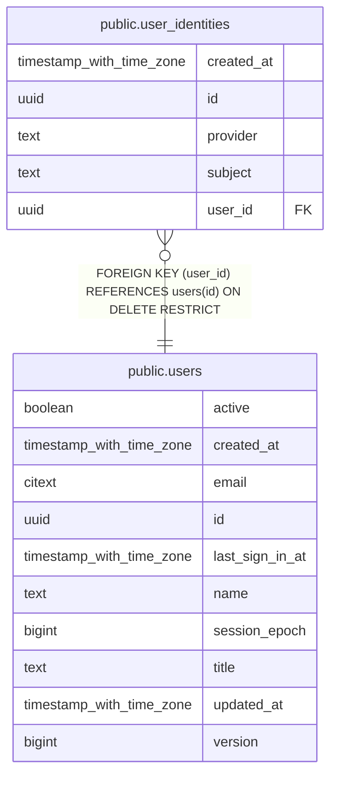

# public.user_identities

## Description

External identity mappings (SSO providers) to unified users

## Columns

| Name       | Type                     | Default           | Nullable | Children | Parents                         | Comment                                              |
| ---------- | ------------------------ | ----------------- | -------- | -------- | ------------------------------- | ---------------------------------------------------- |
| created_at | timestamp with time zone | now()             | false    |          |                                 | When the identity was linked                         |
| id         | uuid                     | gen_random_uuid() | false    |          |                                 | Mapping row UUID                                     |
| provider   | text                     |                   | false    |          |                                 | Identity provider name, e.g. okta                    |
| subject    | text                     |                   | false    |          |                                 | Stable subject issued by the provider                |
| user_id    | uuid                     |                   | false    |          | [public.users](public.users.md) | Owning user; deletion restricted to preserve history |

## Constraints

| Name                                    | Type        | Definition                                                    |
| --------------------------------------- | ----------- | ------------------------------------------------------------- |
| user_identities_created_at_not_null     | n           | NOT NULL created_at                                           |
| user_identities_id_not_null             | n           | NOT NULL id                                                   |
| user_identities_pkey                    | PRIMARY KEY | PRIMARY KEY (id)                                              |
| user_identities_provider_not_null       | n           | NOT NULL provider                                             |
| user_identities_provider_subject_unique | UNIQUE      | UNIQUE (provider, subject)                                    |
| user_identities_subject_not_null        | n           | NOT NULL subject                                              |
| user_identities_user_id_fkey            | FOREIGN KEY | FOREIGN KEY (user_id) REFERENCES users(id) ON DELETE RESTRICT |
| user_identities_user_id_not_null        | n           | NOT NULL user_id                                              |
| user_identities_user_provider_unique    | UNIQUE      | UNIQUE (user_id, provider)                                    |

## Indexes

| Name                                    | Definition                                                                                                            |
| --------------------------------------- | --------------------------------------------------------------------------------------------------------------------- |
| user_identities_pkey                    | CREATE UNIQUE INDEX user_identities_pkey ON public.user_identities USING btree (id)                                   |
| user_identities_provider_subject_unique | CREATE UNIQUE INDEX user_identities_provider_subject_unique ON public.user_identities USING btree (provider, subject) |
| user_identities_user_provider_unique    | CREATE UNIQUE INDEX user_identities_user_provider_unique ON public.user_identities USING btree (user_id, provider)    |

## Relations

---

> Generated by [tbls](https://github.com/k1LoW/tbls)
