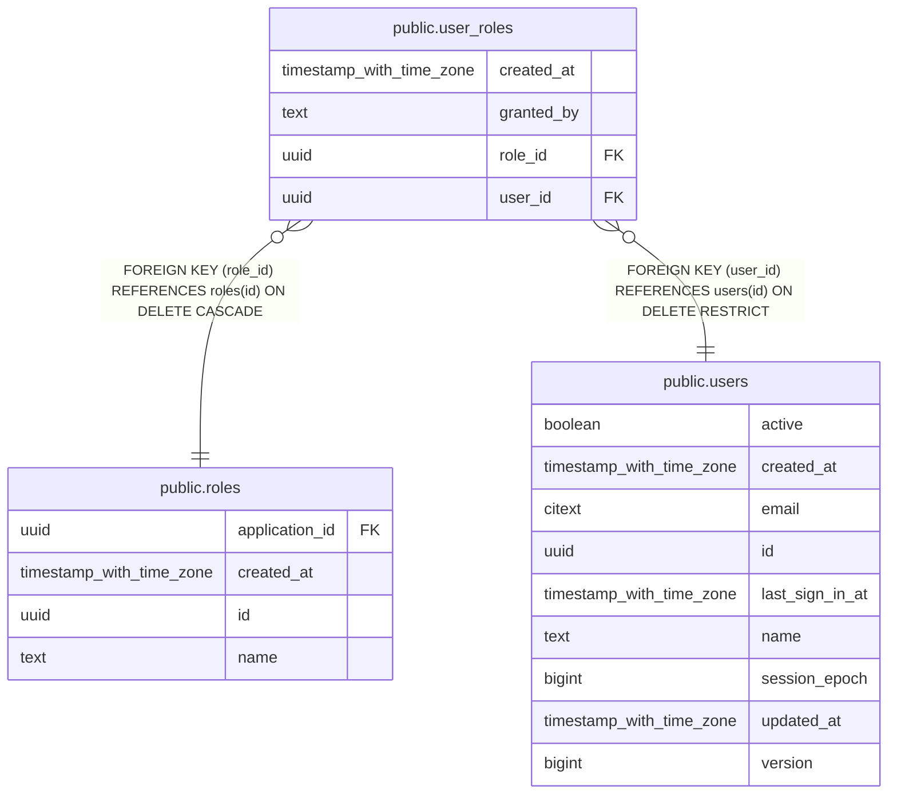

# public.user_roles

## Description

Role assignments; the only source of truth for user access

## Columns

| Name       | Type                     | Default  | Nullable | Children | Parents                         | Comment                                               |
| ---------- | ------------------------ | -------- | -------- | -------- | ------------------------------- | ----------------------------------------------------- |
| created_at | timestamp with time zone | now()    | false    |          |                                 | When the role was granted                             |
| granted_by | text                     | ''::text | false    |          |                                 | Actor that granted the role (cli or a user reference) |
| role_id    | uuid                     |          | false    |          | [public.roles](public.roles.md) | Assigned role                                         |
| user_id    | uuid                     |          | false    |          | [public.users](public.users.md) | Assigned user                                         |

## Constraints

| Name                           | Type        | Definition                                                    |
| ------------------------------ | ----------- | ------------------------------------------------------------- |
| user_roles_created_at_not_null | n           | NOT NULL created_at                                           |
| user_roles_granted_by_not_null | n           | NOT NULL granted_by                                           |
| user_roles_pkey                | PRIMARY KEY | PRIMARY KEY (user_id, role_id)                                |
| user_roles_role_id_fkey        | FOREIGN KEY | FOREIGN KEY (role_id) REFERENCES roles(id) ON DELETE CASCADE  |
| user_roles_role_id_not_null    | n           | NOT NULL role_id                                              |
| user_roles_user_id_fkey        | FOREIGN KEY | FOREIGN KEY (user_id) REFERENCES users(id) ON DELETE RESTRICT |
| user_roles_user_id_not_null    | n           | NOT NULL user_id                                              |

## Indexes

| Name            | Definition                                                                              |
| --------------- | --------------------------------------------------------------------------------------- |
| user_roles_pkey | CREATE UNIQUE INDEX user_roles_pkey ON public.user_roles USING btree (user_id, role_id) |

## Relations

---

> Generated by [tbls](https://github.com/k1LoW/tbls)
