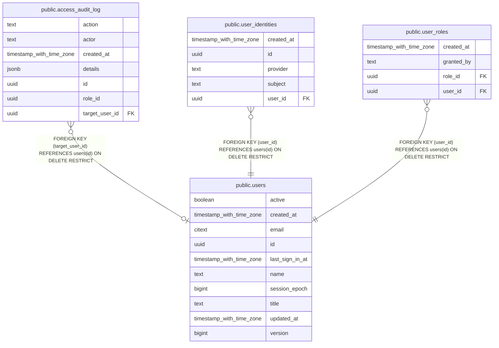

# public.users

## Description

Unified application users shared across GSH/DFM ecosystem

## Columns

| Name            | Type                     | Default           | Nullable | Children                                                                                                                                            | Parents | Comment                                                                                                                                      |
| --------------- | ------------------------ | ----------------- | -------- | --------------------------------------------------------------------------------------------------------------------------------------------------- | ------- | -------------------------------------------------------------------------------------------------------------------------------------------- |
| active          | boolean                  | true              | false    |                                                                                                                                                     |         | Whether login and session validation are allowed                                                                                             |
| created_at      | timestamp with time zone | now()             | false    |                                                                                                                                                     |         | Row creation timestamp                                                                                                                       |
| email           | citext                   |                   | false    |                                                                                                                                                     |         | Email attribute (case-insensitive unique); not an identity key                                                                               |
| id              | uuid                     | gen_random_uuid() | false    | [public.access_audit_log](public.access_audit_log.md) [public.user_identities](public.user_identities.md) [public.user_roles](public.user_roles.md) |         | Stable application-wide user UUID; never changes                                                                                             |
| last_sign_in_at | timestamp with time zone |                   | true     |                                                                                                                                                     |         | Timestamp of the most recent successful sign-in                                                                                              |
| name            | text                     | ''::text          | false    |                                                                                                                                                     |         | Display name                                                                                                                                 |
| session_epoch   | bigint                   | 0                 | false    |                                                                                                                                                     |         | Session generation: bumped in the deactivation transaction; a session is valid only while the epoch it recorded at sign-in equals this value |
| title           | text                     | ''::text          | false    |                                                                                                                                                     |         | Job title from provisioning (SCIM title); empty when unknown                                                                                 |
| updated_at      | timestamp with time zone | now()             | false    |                                                                                                                                                     |         | Row last update timestamp                                                                                                                    |
| version         | bigint                   | 1                 | false    |                                                                                                                                                     |         | Profile version, incremented on every profile/active change; lets consumers drop stale updates                                               |

## Constraints

| Name                         | Type        | Definition             |
| ---------------------------- | ----------- | ---------------------- |
| users_active_not_null        | n           | NOT NULL active        |
| users_created_at_not_null    | n           | NOT NULL created_at    |
| users_email_not_null         | n           | NOT NULL email         |
| users_email_unique           | UNIQUE      | UNIQUE (email)         |
| users_id_not_null            | n           | NOT NULL id            |
| users_name_not_null          | n           | NOT NULL name          |
| users_pkey                   | PRIMARY KEY | PRIMARY KEY (id)       |
| users_session_epoch_not_null | n           | NOT NULL session_epoch |
| users_title_not_null         | n           | NOT NULL title         |
| users_updated_at_not_null    | n           | NOT NULL updated_at    |
| users_version_not_null       | n           | NOT NULL version       |

## Indexes

| Name               | Definition                                                                 |
| ------------------ | -------------------------------------------------------------------------- |
| users_email_unique | CREATE UNIQUE INDEX users_email_unique ON public.users USING btree (email) |
| users_pkey         | CREATE UNIQUE INDEX users_pkey ON public.users USING btree (id)            |

## Relations

---

> Generated by [tbls](https://github.com/k1LoW/tbls)
